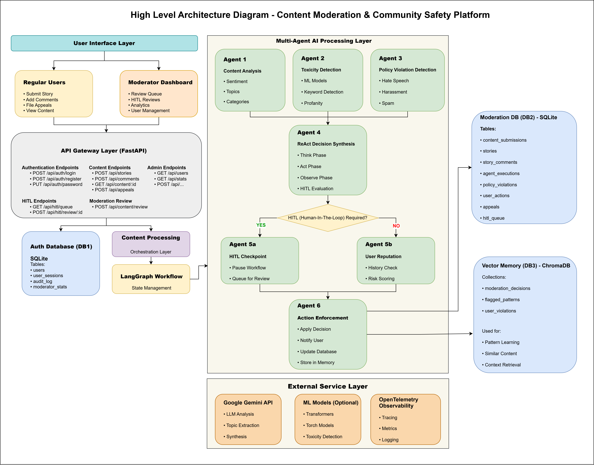

# 🛡️ Content Moderation & Community Safety Platform

**AI-Powered Multi-Agentic Content Moderation System with React Frontend**




## 📖 Table of Contents
- [🎯 Overview](#🎯-overview)
- [⚡ Quick Start](#⚡-quick-start)
- [✨ Features](#✨-features)
- [🏗️ Architecture & Agents](#🏗️-architecture--agents)
- [🧑‍⚖️ Human-in-the-Loop (HITL) System](#🧑‍⚖️-human-in-the-loop-hitl-system)
- [📂 Project Structure](#📂-project-structure)
- [🔧 REST API Endpoints](#🔧-rest-api-endpoints)
- [🛠️ Technology Stack](#🛠️-technology-stack)
- [🎓 Project Highlights & Learning Outcomes](#🎓-project-highlights--learning-outcomes)
- [📈 Use Cases](#📈-use-cases)
- [🎓 Skills Demonstrated](#🎓-skills-demonstrated)
- [🔧 Troubleshooting](#🔧-troubleshooting)
- [🗑️ Database Cleanup](#🗑️-database-cleanup)
- [📝 Resume Talking Points](#📝-resume-talking-points)

## 🎯 Overview

An enterprise-grade content moderation system that automates content safety using a Multi-Agentic AI Architecture powered by Google Gemini free-tier LLM API and LangGraph.

The system processes user-generated content through 6 specialized AI agents using a ReAct (Reason-Act) Decision Loop. It features a **Fast Mode** for high-volume comments and a comprehensive Human-in-the-Loop (HITL) workflow, allowing human moderators to review low-confidence or high-severity decisions.

The platform includes a full-stack React web application serving six distinct user roles:
- **Users (Community Members):** Submit stories and comments, view content, file appeals
- **Moderators:** Review content, approve/warn/remove, basic moderation actions
- **Senior Moderators:** All moderator permissions + HITL queue review, escalations, user suspensions
- **Content Analysts:** View analytics, analyze patterns and trends, export reports
- **Policy Specialists:** Handle appeals, policy violations, user bans
- **Admins:** Full system access, user management, system configuration

## ✨ Features

Click to view each

<details>
<summary><strong>Backend AI System</strong></summary>

| Feature                              | Details                                         |
|--------------------------------------|-------------------------------------------------|
| 🤖 **Multi-Agentic Architecture**    | 6 Specialized AI agents working collaboratively |
| ⚡ **Fast Mode**             | Optimized single-pass moderation for short comments (1-2 seconds vs 6-12 seconds) |
| 🧠 **ReAct Decision Loop**           | Think-Act-Observe pattern for synthesizing agent decisions |
| 🧑‍⚖️ [**Human-in-the-Loop (HITL)**]((https://medium.com/@raj-srivastava/why-agent-assist-human-in-the-loop-is-usually-smarter-than-fully-automated-agentic-ai-bb4e022684a7))      | Configurable interrupt points for human review |
| 📋 **Priority Review Queue**         | Smart prioritization of [HITL (Human-In-The-Loop)](https://medium.com/@raj-srivastava/why-agent-assist-human-in-the-loop-is-usually-smarter-than-fully-automated-agentic-ai-bb4e022684a7) reviews (critical/high/medium/low) |
| 🔍 **ML-Powered Toxicity Detection** | Transformer based models (HateBERT, DistilBERT) or keyword-based detection |
| ⚖️ **Policy Enforcement**            | Automated checking against community guidelines |
| 👤 **User Reputation System**        | Dynamic reputation scoring and risk assessment |
| 📝 **Appeal Workflow**               | Automated appeal review process with HITL support |
| 🎯 **Smart Action Enforcement**      | Content removal, warnings, suspensions, and bans |
| 💾 **Complete Audit Trail**          | Dual SQLite databases stored in databases/ folder: moderation_data.db (content/decisions) and moderation_auth.db (users/auth) - (You can modify to use any other DB) |
| 🧠 **Memory & Learning**             | ChromaDB vector store learns from moderation patterns |
| 📊 **REST API**                      | FastAPI backend with comprehensive endpoints |
| 🔄 **Real-time Processing**          | Instant content analysis with AI workflow pause/resume |
| ⏸️ **Workflow Interrupts**           | Pause workflows for human input, resume automatically |
</details>


<details>
<summary><strong>Frontend Web Application</strong></summary>

| Feature                              | Details                                         | 
|--------------------------------------|-------------------------------------------------|
| ⚛️ **React + Vite**                 | Modern, fast frontend development |
| 🎨 **Material-UI (MUI)**            | Professional, responsive UI components |
| 🏠 **Community Dashboard**          | Main landing page with widget-based architecture (featured stories, community stats, user stats, guidelines) |
| 📖 **Stories Platform**             | Users can create and share stories (moderated before publishing) |
| 💬 **Comments System**              | Users can comment on stories (with real-time moderation) |
| 🔐 **Role-Based Access Control**    | Separate interfaces for users, moderators, analysts, and admins (6 distinct roles) |
| 🔑 **Authentication System**        | User registration, login, and password management |
| 📊 **Moderation Dashboard**         | Integrated HITL (Human-in-the-Loop) review queue with real-time statistics and pending reviews |
| 🔍 **Content Review Interface**     | Detailed review page with AI analysis, toxicity scores, and one-click moderation actions |
| 📈 **Analytics Dashboard**          | Charts, trends, and insights with Recharts |
| 📮 **Appeals Management**           | Interface for users to submit appeals and moderators to review |
| 👥 **User Management**              | Admin interface for CRUD operations on user accounts (create, edit, delete, role changes) |
| 🧩 **Custom Hooks**                 | Reusable data fetching hooks (useStories, useUserStories, useStoryStats, etc.) |
| 📦 **Widget Architecture**          | Modular, reusable UI components for consistent design |
</details>

<details>
<summary><strong>Advanced Features</strong></summary>

#### 🛡️ Guardrails System
- **Loop Detection** - Prevents infinite reasoning loops (max 10 iterations)
- **Hallucination Detection** - Identifies contradictions and unsupported claims in AI decisions
- **Cost Budget Tracking** - Monitors and limits API costs (configurable budget)
- **Consistency Checking** - Ensures agent decisions don't contradict each other
- **Confidence Adjustment** - Automatically reduces confidence when hallucinations detected

#### 🧠 Learning System
- **Episodic Memory** - Stores individual moderation decisions for learning
- **Semantic Memory** - Learns generalized patterns from outcomes
- **Success Rate Tracking** - Monitors decision quality per agent
- **Pattern Recognition** - Identifies which actions work best in specific contexts
- **Adaptive Thresholds** - Learns optimal toxicity/policy thresholds over time
</details>

## 🏗️ Architecture & Agents
The system uses a LangGraph based StateGraph to manage the flow of data between agents.

#### The Agent Workflow

- **Content Analysis Agent:** Extracts topics, sentiment, and media type.
- **Toxicity Agent:** Scores content (0-1) using ML models or keywords.
- **Policy Agent:** Maps content against community guidelines (Spam, Hate Speech, etc.).
- **Reputation Agent:** Checks user history; adjusts risk score based on past violations.
- **Decision Synthesis:** The ReAct loop aggregates all insights.
- **Enforcement Agent:** Executes the action (Ban, Remove, Warn, Approve).

<details>
<summary><strong>View Detailed Agent Specs</strong></summary>

- **Guardrails:** Loop detection (max 10 steps), hallucination checks, and cost budgeting.
Memory:

- **Episodic:** Stores individual decisions.
- **Semantic:** Learns generalized patterns from outcomes.
- **Fast Mode:** A bypass lane for content <200 chars. It skips the multi-agent debate for a single, comprehensive LLM check, reducing cost by ~87%.
</details>
<br/>


## 🧑‍⚖️ Human-in-the-Loop (HITL) System

AI isn't perfect. The system automatically pauses the workflow and flags content for human review based on specific triggers.
Priority Levels:

- 🔴 Critical: Legal concerns, severe toxicity.
- 🟠 High: High-profile user (10k+ followers), conflicting agent signals.
- 🟡 Medium: Potential false positives.
- 🟢 Low: Low confidence scores (<70%).

#### The Workflow:

1. Agents analyze content.
2. Trigger detected (e.g., Confidence = 0.65).
3. State saved -> Added to HITL (Human-In-The-Loop) Queue.
4. Moderator logs in, views "AI Reasoning," and clicks Approve or Remove.
5. Workflow resumes, executing the human's decision and updating Agent Memory.


## 📂 Project Structure

```
content-moderation-system/
├── backend/
│   ├── databases/                 # SQLite & ChromaDB storage
│   ├── src/
│   │   ├── agents/                # AI Agent definitions & LangGraph workflow
│   │   ├── core/                  # Pydantic models & Schemas
│   │   ├── ml/                    # HateBERT/DistilBERT classifiers
│   │   └── memory/                # Vector store logic
│   ├── main.py                    # FastAPI entry point
│   └── scripts/                   # Data initialization tools
│
├── frontend/
│   ├── src/
│   │   ├── components/
│   │   │   ├── Dashboard/         # Moderator HITL Queue
│   │   │   ├── ContentReview/     # Detailed Review Interface
│   │   │   ├── Analytics/         # Charts & Graphs
│   │   │   └── Stories/           # User Facing Feed
│   │   ├── services/              # API Axios instances
│   │   └── store/                 # Zustand state management
│   │   └── App.jsx                # Main app with protected routing
│   ├── package.json               # Node dependencies
│   └── vite.config.js             # Vite configuration
├── .gitignore                     # Git ignore file
└── README.md                      # This file
```

## 🔧 REST API Endpoints

<details>
<summary><strong>Click to view key endpoints</strong></summary>

### Content & Moderation
- POST /api/content/submit - Submit content (Trigger workflow)
- GET /api/stories - Fetch approved stories
- POST /api/stories/{id}/comments - Comment (triggers Fast Mode)

### HITL & Review
- GET /api/hitl/queue - Fetch pending reviews (sorted by priority)
- GET /api/hitl/review/{id} - Get full review packet (AI reasoning + user stats)
- POST /api/hitl/review/{id} - Submit human decision (Resumes workflow)

### Analytics & Users
- GET /api/analytics/trends - Moderation stats over time
- GET /api/auth/users - User management (Admin only)
</details>

## 🛠️ Technology Stack

<details>
<summary><strong>Click to view stack</strong></summary>

### Backend
| Component | Technology | Purpose |
|-----------|------------|---------|
| **AI Framework** | LangChain + LangGraph | Multi-agent orchestration |
| **LLM & Embedding Model** | Google Gemini | AI reasoning and decision-making & Embedding Model|
| **ML Models** | HateBERT, DistilBERT (optional) | ML-based toxicity detection |
| **Web Framework** | FastAPI | REST API backend |
| **Database** | SQLite | Persistent storage |
| **Vector Store** | ChromaDB | Memory and pattern learning |
| **State Management** | LangGraph StateGraph | Workflow state tracking |
| **Authentication** | JWT + HTTPBearer | Secure API access |

### Frontend
| Component | Technology | Purpose |
|-----------|------------|---------|
| **Framework** | React 18 | UI framework |
| **Build Tool** | Vite | Fast development and building |
| **UI Library** | Material-UI (MUI) v5 | Component library |
| **Routing** | React Router v6 | Client-side routing |
| **State Management** | Zustand | Lightweight state management |
| **HTTP Client** | Axios | API communication |
| **Charts** | Recharts + MUI X-Charts | Data visualization |

### DevOps & Tools
| Component | Technology | Purpose |
|-----------|------------|---------|
| **Python** | 3.12+ | Backend runtime |
| **Node.js** | 18+ | Frontend runtime |
| **Package Management** | pip, npm | Dependency management |
</details>

## 🎓 Project Highlights & Learning Outcomes

This project was built to demonstrate advanced Full-Stack and AI Engineering capabilities:

- **Agentic Patterns:** Implementation of Multi-Agent Systems and ReAct reasoning loops, moving beyond simple chatbot wrappers.
- **Hybrid Intelligence:** Designing a Human-in-the-Loop architecture that balances AI speed with human nuance.
- **Production Considerations:** Features like Fast Mode (latency optimization), Cost Budgeting, and Guardrails against hallucination.
- **Complex State Management:** handling asynchronous workflow pauses/resumes in the backend and syncing real-time status updates to the React frontend.
- **Role-Based Security:** Implementing a secure, JWT-based auth system with granular permission controls across 6 user roles.

## 📈 Use Cases

This system is ideal for:

- 🐦 **Social Media Platforms** (Twitter, Reddit, Discord)
- 💬 **Community Forums** (Discussion boards, Q&A sites)
- 🎮 **Gaming Platforms** (Chat moderation, user reports)
- 📺 **Video Platforms** (YouTube comments, live chat)
- 💼 **Enterprise Collaboration** (Slack, Teams, internal forums)
- 📱 **Mobile Apps** (User-generated content moderation)
